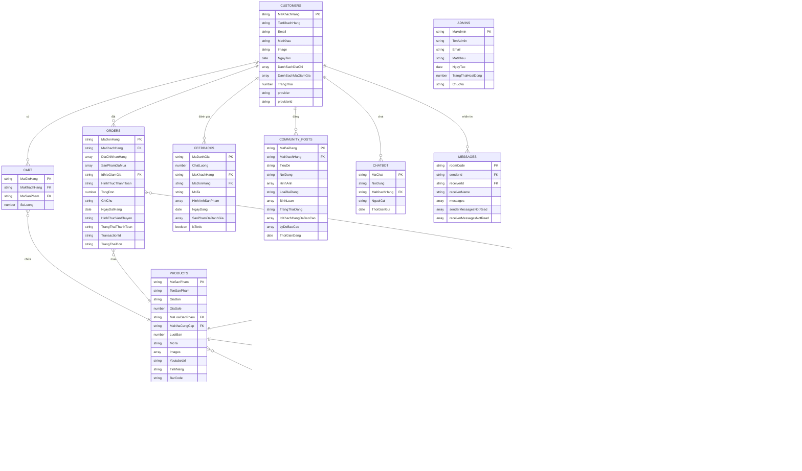

# Mô hình Cơ sở Dữ liệu - Hệ thống E-commerce Gundam

## Sơ đồ ERD (Entity Relationship Diagram)

## Mô tả chi tiết các bảng

### 1. Bảng Quản lý Người dùng
- **CUSTOMERS**: Lưu thông tin khách hàng
- **ADMINS**: Lưu thông tin quản trị viên
- **OTP**: Lưu mã OTP xác thực email

### 2. Bảng Sản phẩm và Danh mục
- **PRODUCTS**: Thông tin sản phẩm Gundam
- **PRODUCT_TYPES**: Phân loại sản phẩm
- **SUPPLIERS**: Nhà cung cấp
- **INVENTORY**: Quản lý tồn kho

### 3. Bảng Mua bán
- **CART**: Giỏ hàng của khách hàng
- **ORDERS**: Đơn hàng
- **DISCOUNT_CODES**: Mã giảm giá

### 4. Bảng Đánh giá và Cộng đồng
- **FEEDBACKS**: Đánh giá sản phẩm
- **COMMUNITY_POSTS**: Bài đăng cộng đồng

### 5. Bảng Thông báo và Chat
- **NOTIFICATIONS**: Thông báo hệ thống
- **CHATBOT**: Lịch sử chat với bot
- **MESSAGES**: Tin nhắn giữa người dùng

### 6. Bảng Quản lý Nhập hàng
- **ENTRY_FORMS**: Phiếu nhập hàng
- **ENTRY_FORM_INFOS**: Chi tiết phiếu nhập

### 7. Bảng Địa chỉ
- **PROVINCES**: Quản lý địa chỉ (Tỉnh/Huyện/Xã)

## Đặc điểm chính của hệ thống

1. **Quản lý đa vai trò**: Khách hàng và Admin
2. **Hệ thống giỏ hàng**: Quản lý đơn hàng chi tiết
3. **Tích hợp thanh toán**: VNPay, mã giảm giá
4. **Cộng đồng**: Bài đăng, bình luận, đánh giá
5. **Chat và thông báo**: Tương tác real-time
6. **Quản lý kho**: Nhập hàng, tồn kho
7. **Bảo mật**: Mã hóa mật khẩu, OTP xác thực
8. **Đa nền tảng**: Hỗ trợ đăng nhập Google

## Các khóa chính và quan hệ

- **Khóa chính**: Tất cả các bảng đều có khóa chính tự động sinh
- **Khóa ngoại**: Liên kết giữa các bảng theo logic nghiệp vụ
- **Mảng dữ liệu**: Sử dụng cho danh sách địa chỉ, hình ảnh, bình luận
- **Timestamps**: Tự động cập nhật thời gian tạo/cập nhật 